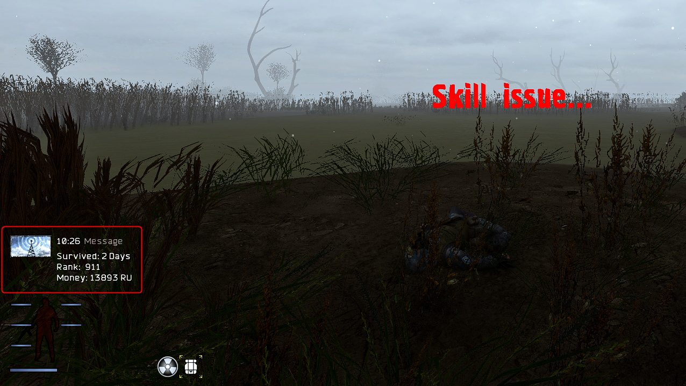

# Asentinn's Ironman: Kill Confirmed

# Description

You started your fresh Ironman run. Got Emergency Armor Repair Set from box, found shotgun on the bandit, survived your first day. Time goes by, you feel more confident and started to behave bit more careless until.. boom headshot. You're dead. Save got deleted and what you've left with is your body laying with a *friendly greeting* message.

Have you ever had a "fuck, am I even getting better at this" moment? I did. I do. I was lacking the possibility to open that PDA once again to see how long have I surived, how much money I've got, maybe how much reputation I have accumulated.

With the **Ironman: Kill Confirmed** you'll get clean run summary as a PDA notification, so you can take a screenshot or just have a mental note of how well did your run go. (*and if you get back to the main menu, you can still preview the values in the console (`~`)*).

# Features

* Shows time survived, current money and reputation earned after you die

# Installation

Download the latest release version and add it using the MO2. It should appear somewhere at the bottom of the modlist.

# Changelog

**v1.0**
* Initial release
* Shows time survived, current money and reputation earned after you die

# Contributing and roadmap

Add your ideas or report bugs in the [issues tab](https://github.com/KamilPacanek/asentinns-ironman-kill-confirmed/issues). To see the roadmap follow to the [milestones page](https://github.com/KamilPacanek/asentinns-ironman-kill-confirmed/milestones).
